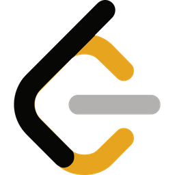

<!-- Profile README - Yashitaa Arya -->

<h1 align="center">Hi there 👋, I'm Yashitaa Arya</h1>

  

---

### 🙋‍♂️ About Me
- 🎓 **B.Tech in Computer Science and Engineering, NIT Hamirpur (2026)**
- 🤖 Member, Robotics Society @ NIT-H
- 💻 **Tech Stack:** Python, C/C++, OOPs, DSA, ROS
- 🌱 Currently exploring: Robotics, AI, and advanced coding challenges
- 🎯 Platforms: LeetCode, CodeChef, Codeforces
- 🎵 Hobbies: Singing & Astronomy

---

### 🚀 Featured Projects

1. [**SLAM Mantis Bot**](https://github.com/YashitaaArya/Mantis): Simultaneous Localization and Mapping bot using LIDAR and Odometry.
2. **Operating System Codes**: Implementations of process scheduling, deadlock handling, and memory management.
3. [**Text Summariser GUI**](https://github.com/YashitaaArya/Text-Summariser-UI): Summarize texts and URLs using Python and NLTK.  
   [Devfolio: Zip the Text](https://devfolio.co/projects/zip-the-text-635e)

🔍 <b>More Projects</b>

- Explore my repositories—feedback and stars are always welcome!

---

### 🛠️ Tech Stack

  
  
  
  
  

---

### 📊 GitHub Stats

  
  
  

### 🏅 Badges Earned

  
  
  
  <!-- Add more badges you earned by copying their image URLs -->

---

### 🏆 Achievements & Fun

  

---

### 💬 Get in Touch

  
  
  

---

  

<b>Let's connect and create something amazing together! 🚀</b>

